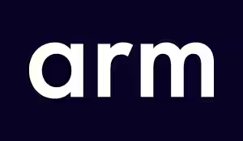

## What is Assembly?

---

### What is Assembly?

<ol>
<li class=fragment>A set of pieces that work together</li>
<li class=fragment>The act or process of putting together a set of pieces</li>
<li class=fragment>A congregation of people in one place for a purpose</li>
<li class=fragment><em>(politics)</em> A legislative body</li>
<li class=fragment><em>(military)</em> A drum beat signal for troops to assemble</li>
<li class="fragment" data-autoslide="300"><em>(computing)</em> <b>Ellipsis of assembly language</b></li>
</ol>

Thanks [wiktionary](https://en.wiktionary.org/wiki/assembly).

<!-- .element: class="attribution fragment" -->

Notes:

- need to highlight 6 appropriately

---

## Assembly Language

---


By [Peter J. Yost](https://commons.wikimedia.org/w/index.php?curid=98351026) - Own work, CC BY-SA 4.0

<!-- .element: class="attribution" -->

---





<!-- .slide: data-auto-animate -->

---


```asmmy
0fafff    imul edi, edi
89f8      mov eax, edi
c3        ret
```


```asmmy
1b007c00  mul w0, w0, w0
d65f03c0  ret
```


```asmmy
02a5053b  mul a0, a0, a0
8082      ret
```

<!-- .slide: data-auto-animate -->

Notes:

---

```asmmy
 ret
 inc ax
 add rcx, rdx
 imul rax, rbx, rdx
```

---

Registers
---

```cpp
// setup
  #include <string_view>

constexpr auto valid_chars = "0123456789abcdef";

bool is_valid_id(std::string_view maybe_id) {
  if (maybe_id.size() != 16) {
    return false;
  }
  if (maybe_id.find_first_not_of(valid_chars) != std::string_view::npos) {
    return false;
  }
  return true;
}
```

<!-- .element: data-ce data-ce-options="-O1" -->

---

## Thanks!

Oh wait, is that the time?

<!-- .element class="fragment" -->

---

## What is Assembly?

<ol>
<li>A set of pieces that work together</li>
<li>The act or process of putting together a set of pieces</li>
<li>A congregation of people in one place for a purpose</li>
<li><em>(politics)</em> A legislative body</li>
<li><em>(military)</em> A drum beat signal for troops to assemble</li>
<li><em>(computing)</em> Ellipsis of assembly language</li>
</ol>

Thanks [wiktionary](https://en.wiktionary.org/wiki/assembly).

<!-- .element: class="attribution" -->
