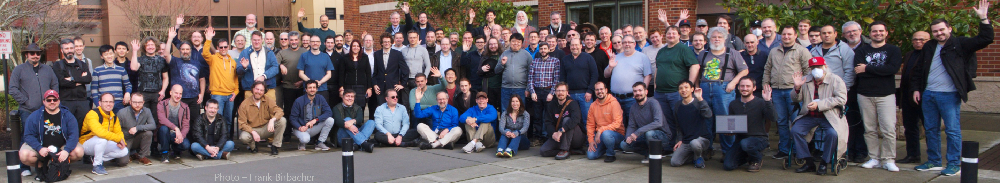
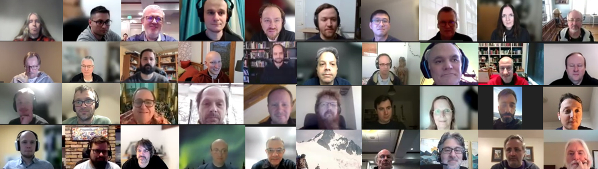

<h2 class="r-fit-text">A legislative body (politics)</h2>

---

## The C++ Committee

aka WG21 <!-- .element: class="fragment" -->

---

Notes:

ISO International Organization for Standardization

---

Notes:

International Electrotechnical Commission

---

Notes:

ISO/IEC JTC 1 (Joint Technical Committee 1) "Information technology"

---

## ISO/IEC JTC 1/SC 22

Programming languages, their environments  and system software interfaces

---

PLIP

WG 1

Pascal

WG 2

APL

WG 3

COBOL

WG 4

Fortran

WG 5

ALGOL

WG 6

PL/I

WG 7

BASIC

WG 8

Ada

WG 9

Guidelines

WG 10

Binding Techniques

WG 11

Conformity

WG 12

Modula-2

WG 13

C

WG 14

POSIX

WG 15

ISLisp

WG 16

Prolog

WG 17

FIMS

WG 18

Formal Spec. Lang

WG 19

Internationalization

WG 20

C++

WG 21

PCTE

WG 22

PL Vulnerabilities

WG 23

Linux

WG 24

Notes:

- JTC1
  - SC22
    - WG21
      - SG1...SG23

---

  

  

    

SC22

      

WG21

        

AG

        

DG

        

ARG

        

CWG

        

EWG

        

LWG

        

LEWG

        

SG1

        

...

        

SG23

        

      

    

  
 

---

The process, TS, whatnot.

---

<h3>vs</h3>

Notes:
- Single implementation
  - Leadership council
  - RFCs

---

<h3>vs</h3>

Notes:
- was: BFDL, Guido stepped down in 2018
- Now Community Governance
- BDFL -> Steering Council (5 ppl)
- Annual release
- PEPs

---

<h3>vs</h3>

Notes:
- Javascript (Vendor consensus)
- ECMA's TC39 Committee
 - (stndards body, also does C# Dart)
- 5 stage process

---

Photo - Frank Birbacher

Notes:
- Formal process
- Multiple implementations
- Vendors still have flexibility to add things they want
- But we can all (mostly) rely on writing the same C++ and have it work everywhere
- Long process, but results are long-lived
  - code from 1970s still works in our code base! ABIs etc
- HUGE thanks to folks who volunteer their time, and their employers, to make C++ what it is

---

## A legislative body

✅

