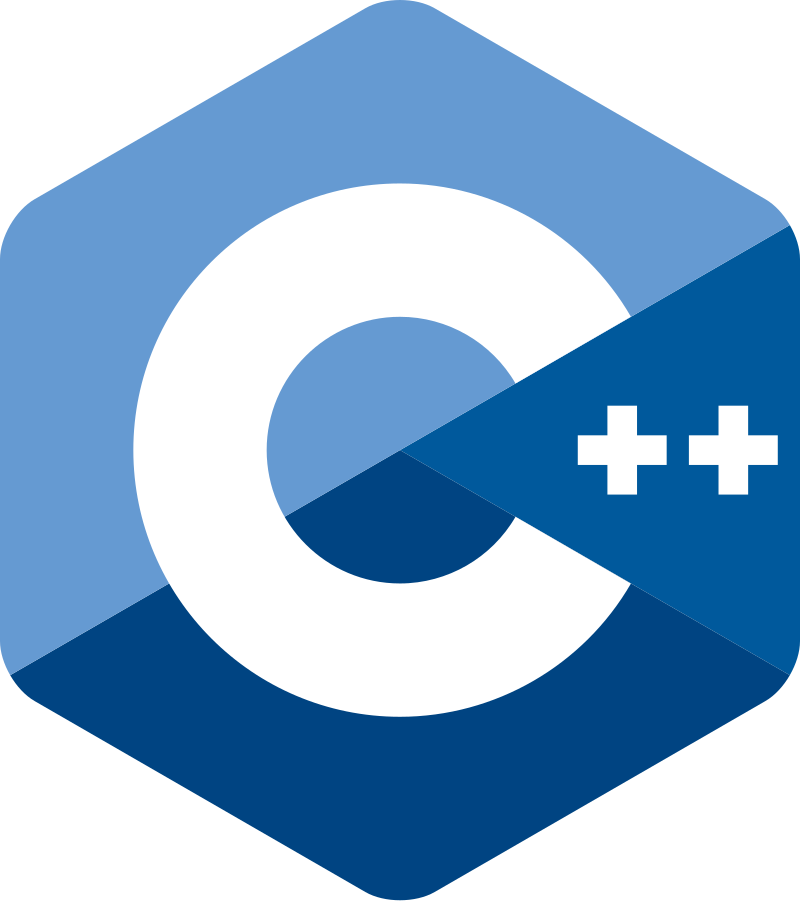

<h2>A drum beat signal for troopsC++ coders to assemble</h2>

<!-- .slide: data-auto-animate -->

---

<h2>A drum beat signal for troopsC++ coders to assemble</h2>

<!-- .slide: data-auto-animate -->

---

# This is your community

Notes:

Amazing community to be part of, blessed to have lucked into it and CE etc

---

# It takes a village

Notes:

- on ramps for new people for your codebase
- contribute to an OSS or
- open source something!
- get involved! go to a meetup. do a conference talk
- participate in the standards!

---

# Some Assembly Required
