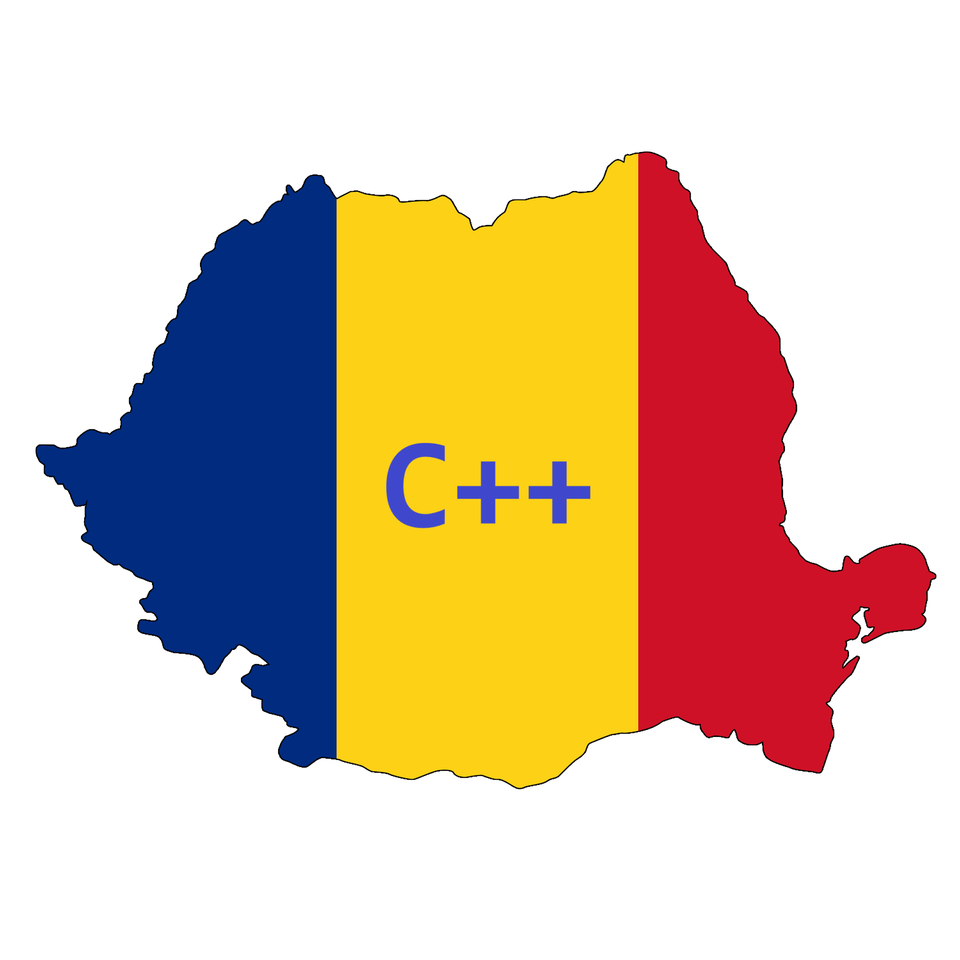
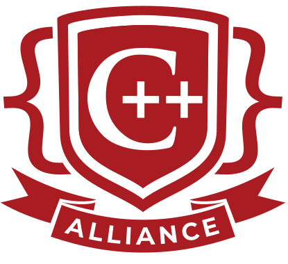
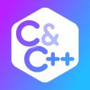
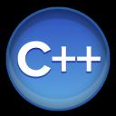
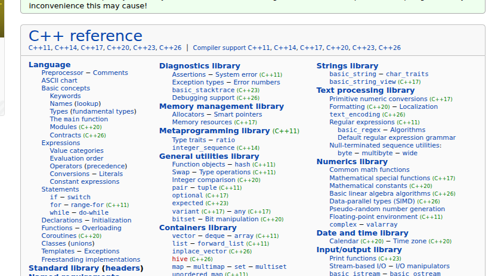
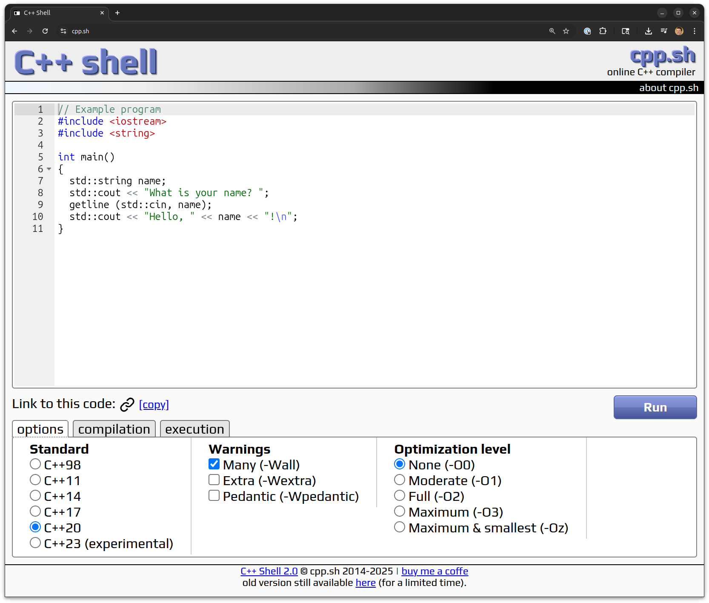
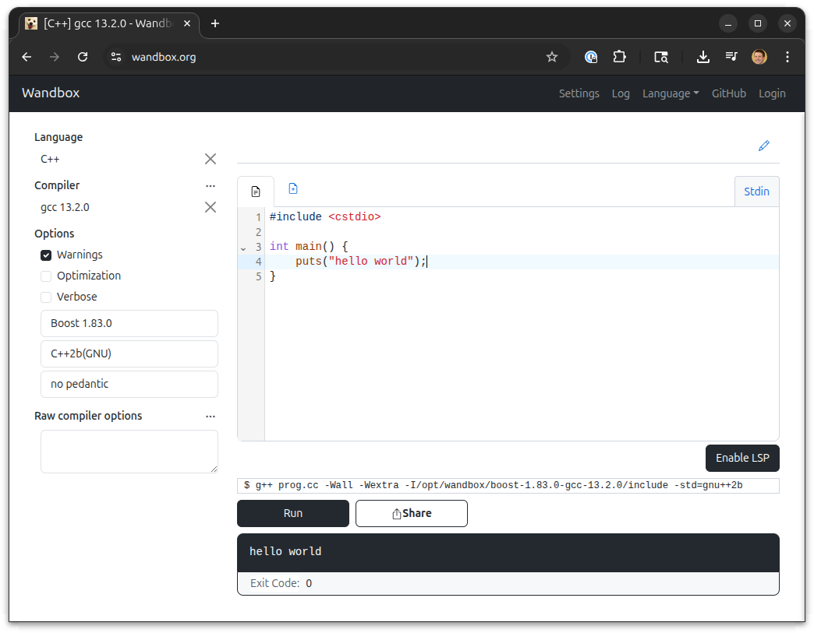
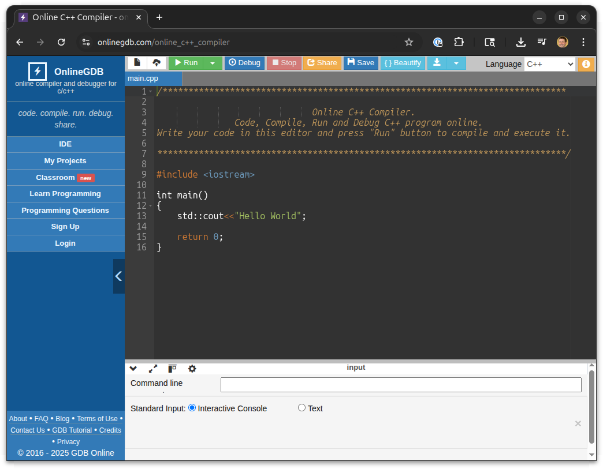
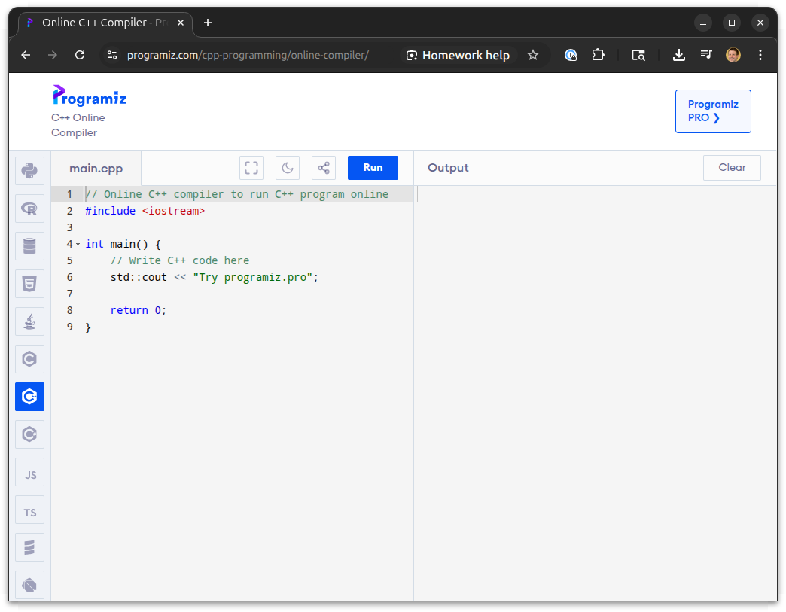
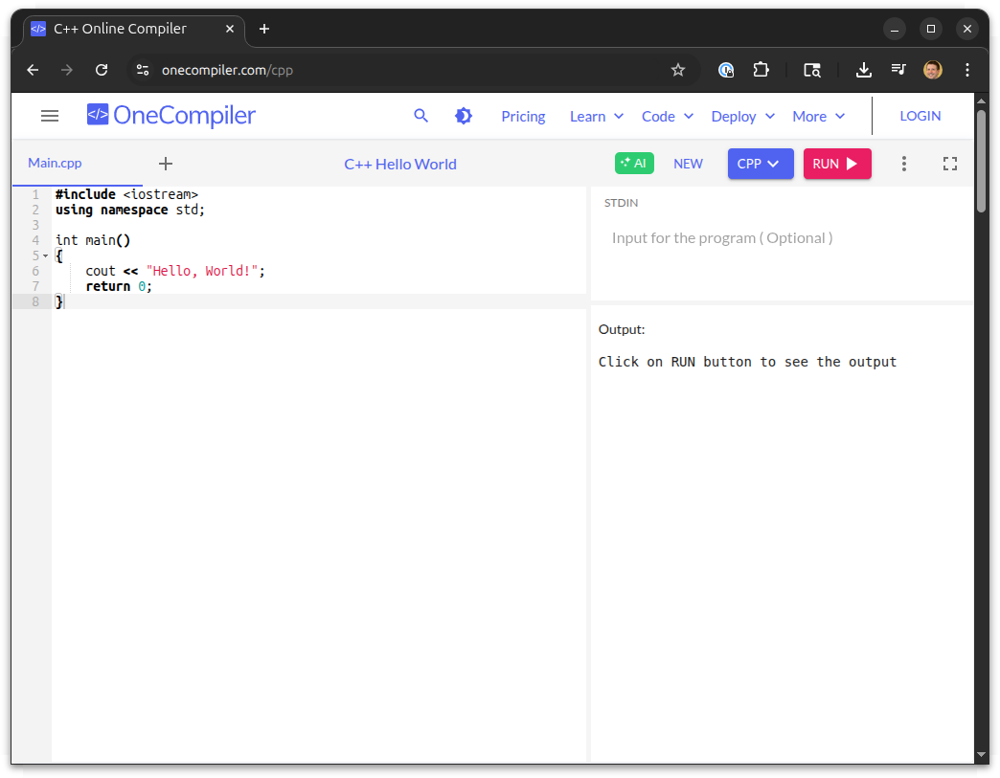

<h2 class=r-fit-text>A congregation of people in one place for a purpose</h2>

<!-- .element: class="r-fit-text" -->

---

Notes:
One of the most powerful parts of C++ is not the language, or the libraries, or the tools. But YOU - the people! Without individuals and groups teaming up to make C++ what it is, we would not have this amazing language and ecosystem.

There's so many ways to participate - being here is just one part of that:

---

### 📈 C++ Conferences Growth (2014-2025)

#### Number of Major C++ Conferences Worldwide

    <canvas id="conferenceChart"></canvas>

    

        

        Pre-Pandemic Growth
    

    

        

        Pandemic Impact
    

    

        

        Recovery & Growth
    

Notes:

There's so many C++ conferences: and numbers still growing, and we've recovered from the pandemic. That's not the only way though.

C++ Online,using std::cpp, ACCU, C++ on Sea, C++Now, CppNorth, CppCon, NDC Tech, C++ Day, Core C++, Meeting C++

---

<h2>...</h2>

Notes:

- Meeting CPP lists 113 C++ User Groups
- there's bound to be one near you

---

Notes:

Slack, C++ Alliance
10+ Discords, all of which seem to use similar logos

---

---

---

<h2>A congregation of people in one place for a purpose</h2>

✅

