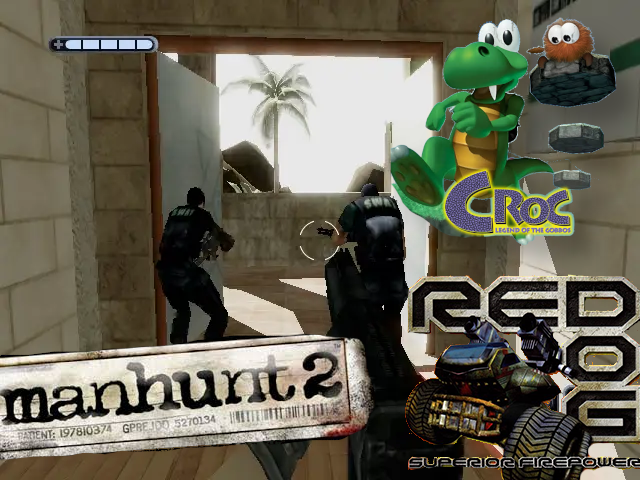
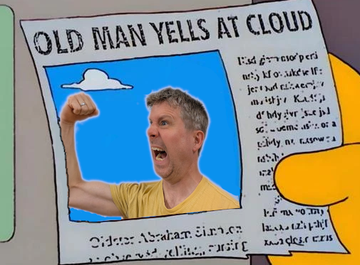

<div class="r-stack r-stretch">


</div>

---


---

<div class="r-stack r-stretch">


</div>

---

<iframe src="https://spectrum.xania.org/embed.html?load=https%3A%2F%2Fcors.archive.org%2Fcors%2Fzx_Mugsy_1984_Melbourne_House%2FMugsy_1984_Melbourne_House.z80" 
data-preload width=640px height=512px>

---

<div class="r-stack r-stretch">


</div>

---


---


Thanks [Gerph](https://gerph.org/riscos/ramble/earlyinternet-serversirc.html#IRClient).

<!-- .element: class="attribution" -->

---


Source on GitHub: [mattgodbolt/irclient](https://github.com/mattgodbolt/irclient).

<!-- .element: class="attribution" -->

---


Source on GitHub: [mattgodbolt/xania](https://github.com/mattgodbolt/xania).

<!-- .element: class="attribution" -->

Notes:

- Mud
- irony of first C++ code was "eliza" <-> AI
- mention talk on updating the code?

---



---

```asmsh
  MOV.W	@strip+, vert		        ; get the vertex number
  ADD		#24, kmPtr			        ; move kmPtr past UV

  FMOV.D	@uvArray+, UV		      ; get the UV values
  MOV		vert, uvPasted

  ADD		#24, kmPtrPasted	      ; move kmPtrPasted past
  SHLL2	uvPasted			          ; uvPasted *= 4

  MOV.W	@strip+, nextVert	      ; get the next vertex number

  SHLL8	vert				            ; vert = vert * 256

  ADD		uvPasted, uvPasted      ; uvPasted *= 8 in total now

  SHLR2	vert				            ; vert = (vert * 256) / 4  == vert * 64

  ADD		uvArrayPasted, uvPasted	; uvPasted points at the pasted UVs
```

Source on GitHub: [mattgodbolt/reddog](https://github.com/mattgodbolt/reddog)

<!-- .element: class="attribution" -->

---


---

# Assembly is still important!

Notes:

# KNOWING HOW THINGS REALLY WORK

---


