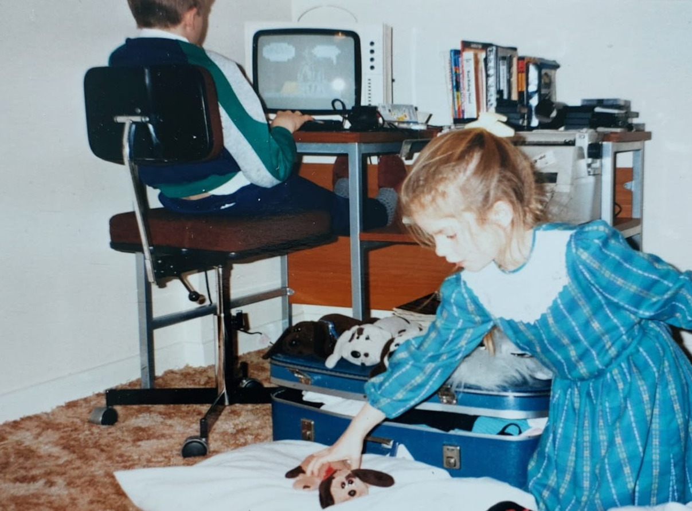
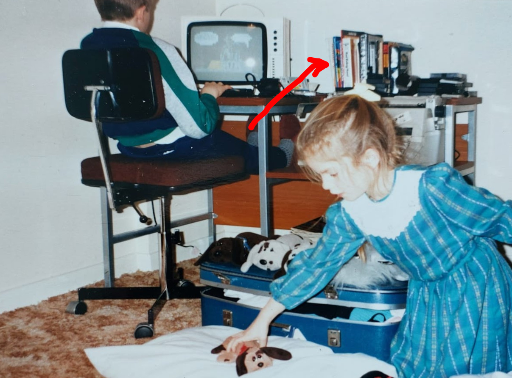
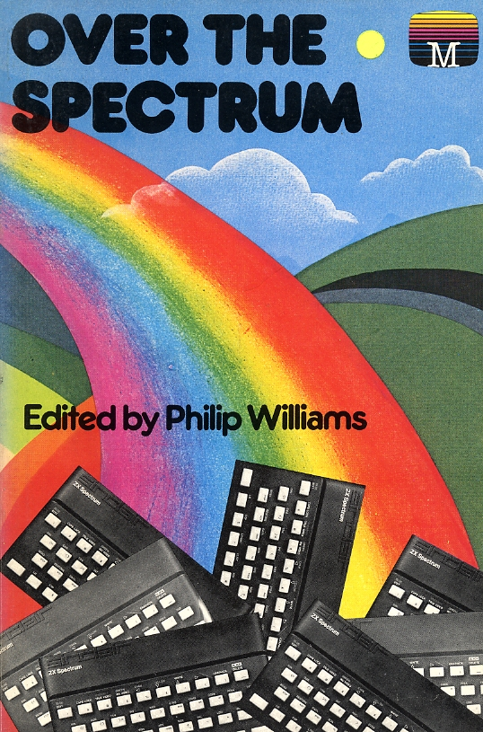
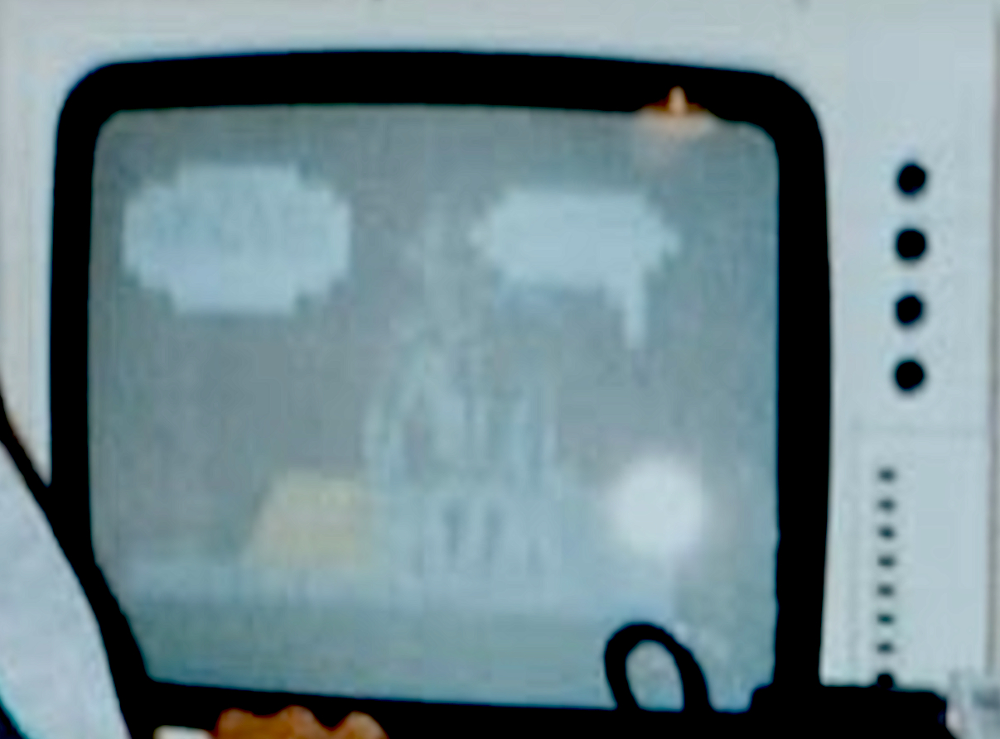
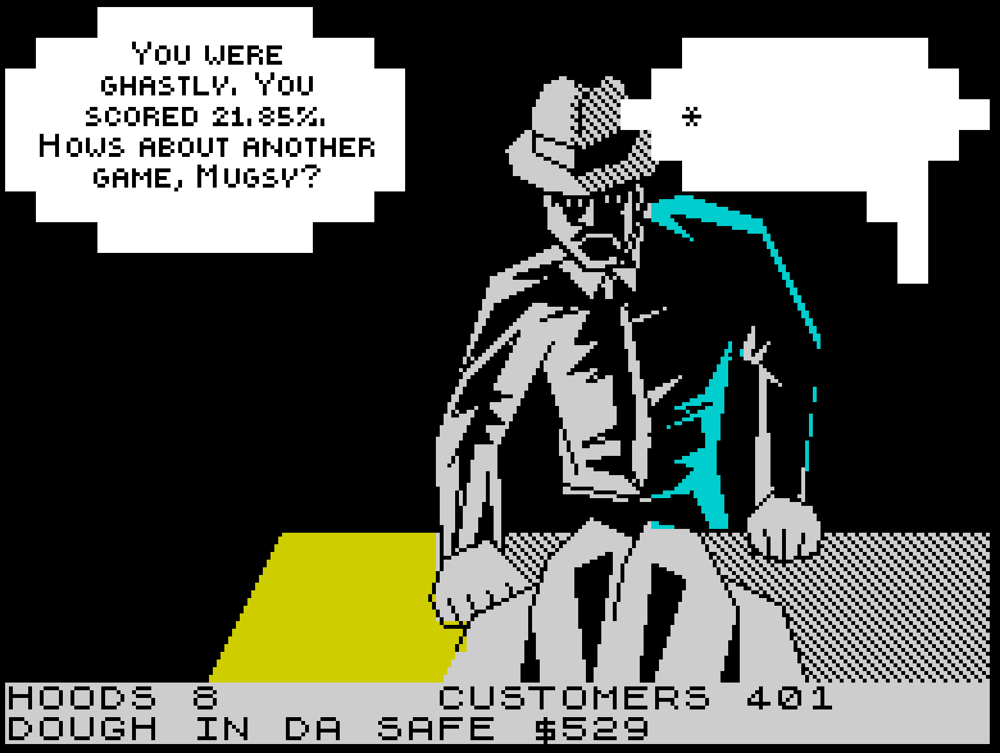
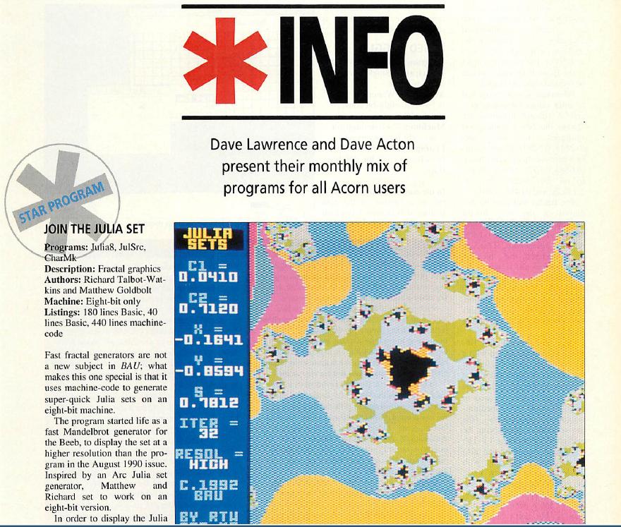
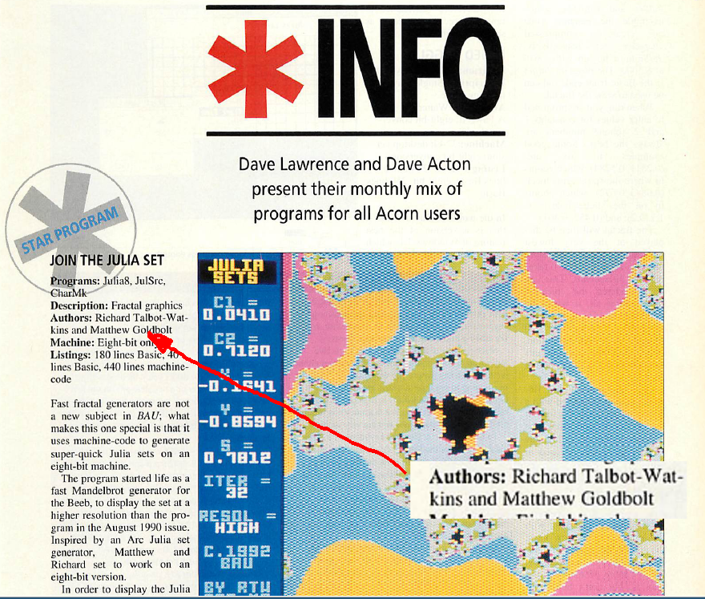
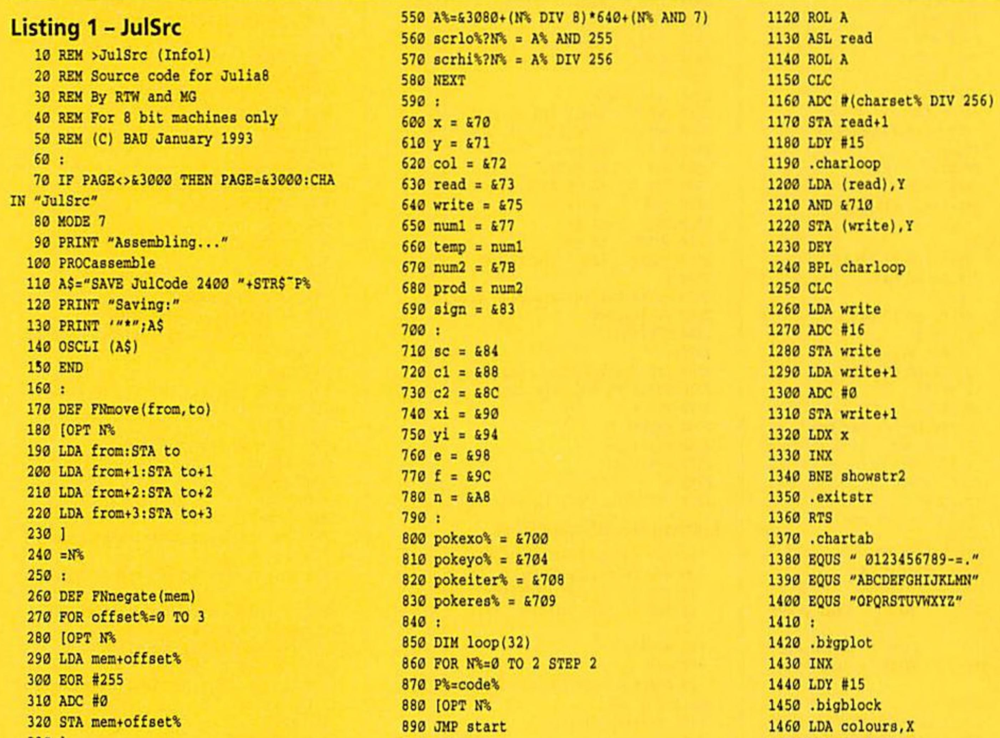
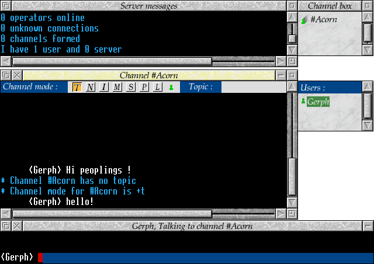
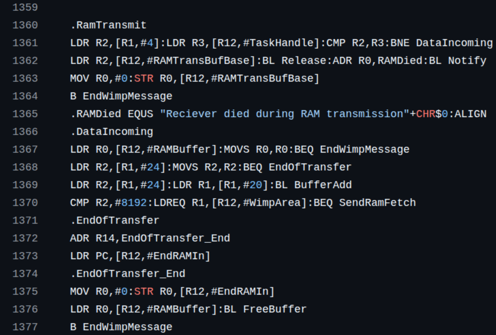

---

---

---

<iframe src="https://spectrum.xania.org/embed.html?load=https%3A%2F%2Fcors.archive.org%2Fcors%2Fzx_Mugsy_1984_Melbourne_House%2FMugsy_1984_Melbourne_House.z80" 
data-preload width=640px height=512px>

---

---

---

---

Thanks [Gerph](https://gerph.org/riscos/ramble/earlyinternet-serversirc.html#IRClient).

<!-- .element: class="attribution" -->

---

Source is on GitHub: [mattgodbolt/irclient](https://github.com/mattgodbolt/irclient).

---

## Uni days: asm doesn't scale

- Mud
- mention talk on updating the code?

---

## C++ and games
montage of games

---

## but assembly is still important

---

