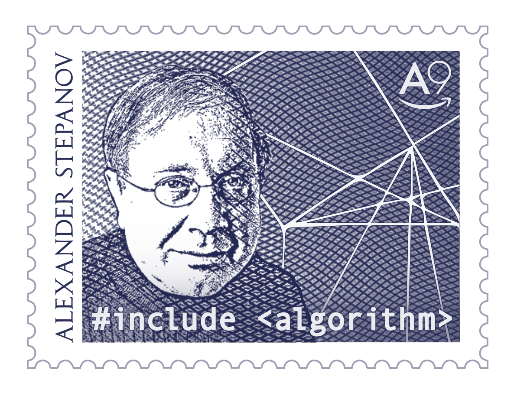
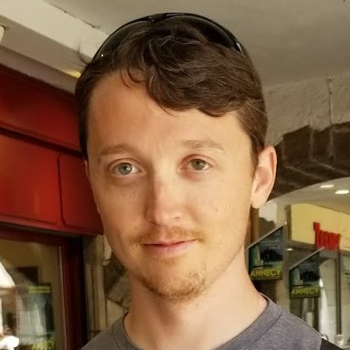
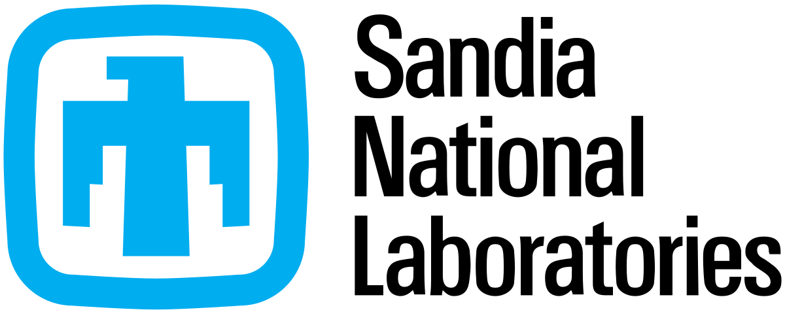
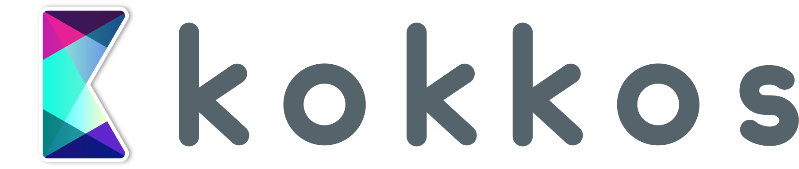
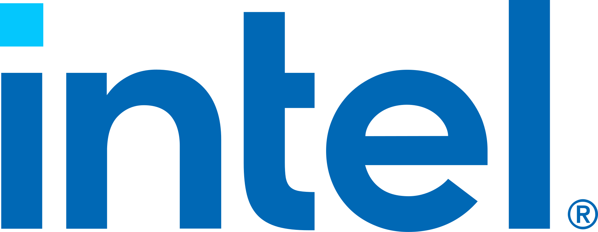
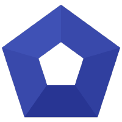
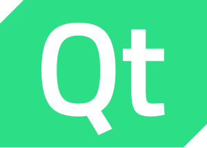
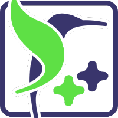
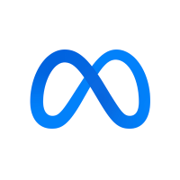
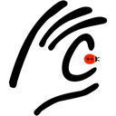

<h2>A set of pieces <br>that work together</h2>

<!-- .element: class="r-fit-text" -->

Notes:
ASK THE AUDIENCE

---

## Libraries

Notes:

A language is a great thing, and C++ is a powerful language. However, if you have to do everythign yourself every time, then it becomes a drag. Part of the appeal of a language is the ecosystem of libraries that come with it, or are easily accessible.

Now, we'll get to the ease of accessing libraries in a second, but first, let's talk about the amazing library that ships with every C++ compiler - the Standard Template Library.

---

## <span data-id="ST">ST</span><span data-id="epanov" style="font-size: 0px">epanov and </span><span data-id="L">L</span><span data-id="ee" style="font-size: 0px">ee<span>

<!-- .slide: data-auto-animate -->

Notes:

- 70s -> 90s, Stepanov, first at GE with David Musser
- Later HP , then SGI

---

## <span data-id="ST">ST</span><span data-id="epanov" style="font-size: 0px">epanov and </span><span data-id="L">L</span><span data-id="ee" style="font-size: 0px">ee<span>

```scheme []
(define (count predicate list)
  (let ((result 0))
    (for-each 
      (lambda (x) 
        (if (predicate x)
            (set! result (+ result 1))))
      list)
    result))
```

<!-- .slide: data-auto-animate -->

Notes:

- Scheme (1986) 
- From the notes, page 9 and expanded on page 46

---

## <span data-id="ST">ST</span><span data-id="epanov" style="font-size: 0px">epanov and </span><span data-id="L">L</span><span data-id="ee" style="font-size: 0px">ee<span>

```ada []
generic
  with function Test(E : Element) return Boolean;
function Count_If(S : Sequence) return Integer;
-- Returns a non-negative integer, the number
-- of elements E of S such that Test(E) is true.

function Count_If(S : Sequence) return Integer is
  function Test_Aux is new Make_Test_If(Test);
  function Count_Aux 
    is new Algorithms.Count(Test_Aux);
begin
  return Count_Aux(S);
end Count_If;
```

<!-- .slide: data-auto-animate -->

Notes:
- 1987-88
- Ada Generic Library paper

---

## <span data-id="ST">ST</span><span data-id="epanov" style="font-size: 0px">epanov and </span><span data-id="L">L</span><span data-id="ee" style="font-size: 0px">ee<span>

```cpp []
template<class InputIterator, class Predicate>
typename iterator_traits<InputIterator>::difference_type
count_if(InputIterator first, InputIterator last, 
         Predicate pred) {
  typename iterator_traits<InputIterator>::difference_type n = 0;
  for (; first != last; ++first)
    if (pred(*first))
      ++n;
  return n;
}
```

<!-- .slide: data-auto-animate -->

Notes:

- Evolution
  - Scheme: Higher-order functions with predicates
  - Ada: Generic packages with formal function parameters
  - C++: Templates with iterators and predicates
- "templates like Ada - explicit instantiation"
- implicit "crucial"
- STL -> early Jan 94, Andy Koenig "if you want STL in the standard, we need the proposal by the 25th"
- "Are you crazy?"
- 80h weeks
- 80% approval, largest ever
- after HP; Stepanaov continued STL dev at SGI (HP STL) (threading fix)
  - fed into libstdc++

In the 70s through to early 90s, Alexander Stepanov (with the later help of Meng Lee) was working on a generic programming library (working with and following on from David Musser), first in Scheme, then Ada, before trying out C++. At first it wasn't possible to achieve his goals in C++ - as templates hadn't been invented yet. Stepanov apparently argued with Bjarne that C++'s templates should be more like Ada's, with explicit instantiation. Bjarne didn't listen, and ultimately their implicit nature turned out to be "crucial" for STL (Stepanov's words).

One of the interesting innovations was the fact that the complexity guarantees were part of the spec.

We very nearly didn't get the STL, early January 1994, Andy Koenig emailed Stepanov to say "if you want STL in the standard, we need the proposal by the 25th". Stepanov: "Are you crazy?" - Stepanov and Meng Lee worked 80h weeks to create the proposal, reimplementing several pieces as they found flaws. 80% approval from the committee - largest proposal ever. Even after they said they wouldn't accept major proposals!

---

## <span data-id="ST" style="font-weight: bold">ST</span><span data-id="epanov">epanov and </span><span data-id="L" style="font-weight:bold">L</span><span data-id="ee">ee<span>



<!-- .slide: data-auto-animate -->

Notes:

- Stepanov said the STL should stand for "STepanov and Lee".
- Thanks HP, SGI. PJ Plauger Dinkumware
- david stone gave a talk: "functions want to be free"
- set tone for C++
- STL != Standard Library

Thanks to Hewlett-Packard for letting Stepanov make the STL free for all, and SGI for continuing to keep Stepanov's work free. And to PJ Plauger at Dinkumware for taking the STL and making it production-ready, and licensing it to MS.

It set the tone of what _I_ think of as C++, and generic programming. But it's not the only library in town, and it's grown a lot since!

Standard Library != STL

---

<div class="boosties">
<div class="fragment cpp11">unique_ptr</div>
<div class="fragment cpp11">shared_ptr</div>
<div class="fragment cpp11">weak_ptr</div>
<div class="fragment cpp11">type_traits</div>
<div class="fragment cpp11">regex</div>
<div class="fragment cpp11">random</div>
<div class="fragment cpp11">tuple</div>
<div class="fragment cpp11">thread</div>
<div class="fragment cpp11">chrono</div>
<div class="fragment cpp11">array</div>
<div class="fragment cpp11">function</div>
<div class="fragment cpp11">reference_wrapper</div>
<div class="fragment cpp14">make_unique</div>
<div class="fragment cpp17">optional</div>
<div class="fragment cpp17">any</div>
<div class="fragment cpp17">variant</div>
<div class="fragment cpp17">filesystem</div>
<div class="fragment cpp17">string_view</div>
<div class="fragment cpp23">flat_map</div>
<div class="fragment cpp23" data-autoslide="0">stacktrace</div>
</div>

<!-- .slide: data-autoslide="200" -->

---


Notes:

- started in 1998 between Beman Dawes and Robert Klarer
  - joined by Dave Abrahams
- first official release '99
- Field experience!
  - boost filesystem 19 years to standardize
- High quality components, not _necessarily_ targeted for standardization, e.g.
  - boost::spirit
  - boost::python
  - boost::compute
  - boost::WinApi

---

<div class="container">
<h2>The Beman Project</h2>
</div>

Notes:

- Beman Dawes passed away suddenly December 2020
- Announced CppNow 2024 by David Sankel. Involve og boost; Dave Abrahams, streamlined process
- Beman _explicitly_ states plan for standardization.
- 13 libraries, including
  - optional extensions
  - scope
  - task
  - any_view.

### Complementary to boost. NOT competitive

---

<div class="libs">
<div class="lib"><div class="name">ranges</div></div>
<div class="lib"><div class="name">format</div></div>
<div class="lib"><div class="name">date</div></div>
<div class="lib"><div class="name">span</div></div>
<div class="lib lots">





<div class="name">mdspan</div></div>
</div>

---

<div class="libs lots">
<div class="lib"><div class="name">abseil</div></div>
<div class="lib"><div class="name">Qt</div></div>
<div class="lib"><div class="name">co_curl</div></div>
<div class="lib"><div class="name">nlohmann/json</div></div>
<div class="lib"><div class="name">doctest</div></div>
<div class="lib"><div class="name">Dear ImGui</div></div>
 <div class="lib"><div class="name">simdjson</div></div>
<div class="lib"><div class="name">folly</div></div>
<div class="lib"><div class="name">poco</div></div>
<div class="lib"><div class="name">eigen</div></div>
<div class="lib"><div class="name">googletest</div></div>
<div class="lib"><div class="name">flux</div></div>
<div class="lib"><div class="name">Catch2</div></div>
<div class="lib"><div class="name">RapidJSON</div></div>
<div class="lib"><div class="name">ctre</div></div>
<div class="lib"><div class="name">Seastar</div></div>
<div class="lib"><div class="name">Lyra</div></div>
<div class="lib"><div class="name">Cpptrace</div></div>
<div class="lib"><div class="name">Kokkos</div></div>
</div>

---

<h2>A set of pieces <br>that work together</h2>

<p class="checkmark fragment">✅</p>

Notes:

C++ has a large set of pieces that work together. The ABI, while contentious, does help us keep those pieces working together.
