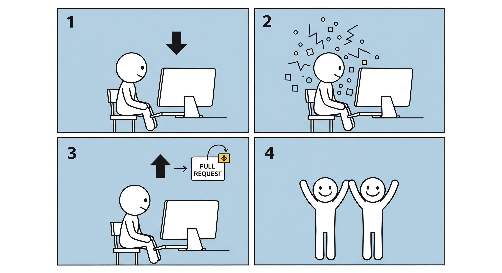

<h2>The process of putting  together a set of pieces</h2>

<!-- .element: class="r-fit-text" -->

---

---

### make

---

### cmake
### ninja
### bazel/buck
### scons
### meson

---

### bash scripts and python side tooling
### Maybe more in C++ with reflection!
### libclang
### dehydra story?

---

### packaging

---

### CPM
### vcpkg
### conan

---

### other tools
### sanitizers?

---

### Human side
- documentation!
- the how and why, the Tao
- coding conventions
- linters
- formatters
- Wall Wextra Wsign-conversion
- Compiler Explorer!? :D
