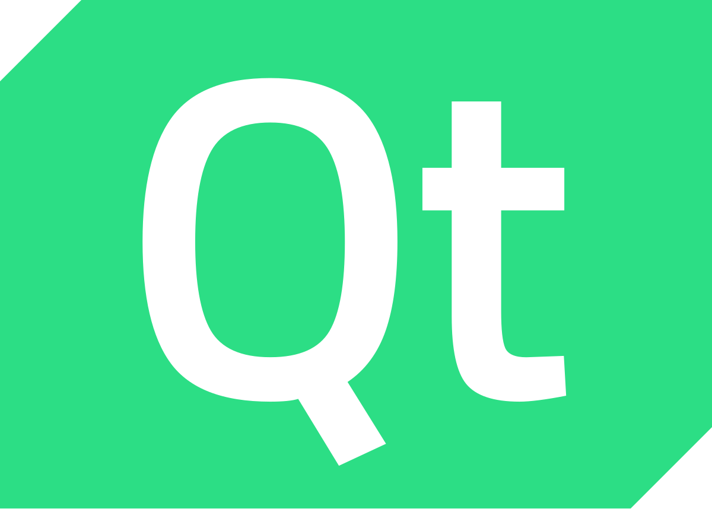
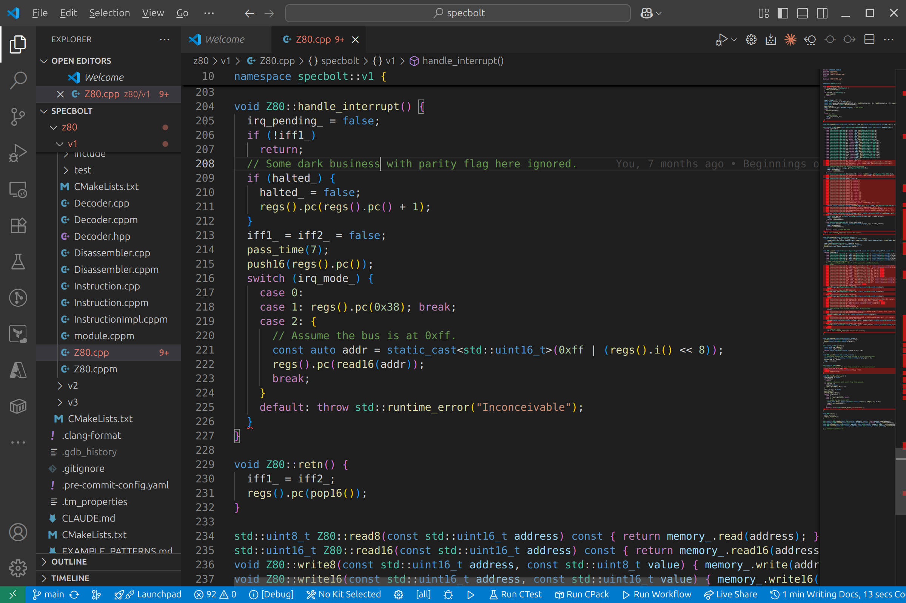

<h2>The process of putting  together a set of pieces</h2>

<!-- .element: class="r-fit-text" -->

Notes:
ASK THE AUDIENCE

---

Notes:

How _do_ we put together software? There's a number of ways

ASK THE AUDIENCE

- Compiling code
- Creating, editing and understanding the code
- Building it
- Using those libraries, at least the ones that don't ship with the compiler

Got add compilers to the list of things that where some assembly is required. We need compilers
We can also do a little bit of a history of the compilers, maybe even some cfront
While we're talking about compilers, we can show off compiler explorers, list of compilers and say we have lots of compilers. Ask me how I know
We can talk about refactoring tools like libclang
I can even allude to what Nik and I did at profactor
If it fits in, I can plug bronto source
We can show vim and emacs and a completely tricked out IDE
Maybe mention AI coding assistance

Then how do we build

So many choices

How do we even get the code? Packaging etc

---

Notes:
glorious choice of compilers
history of cfront? My first C++ compiler was cfront
gcc -> g++
msvc early intro
clang/llvm project

ask me how I know we have lots of compilers to pick from

---

Notes:

- spaces vs tabs. joke I use one of each so everyone's unhappy

---

---

---

---

---

---

---

make

msbuild

cmake

ninja

bazel

buck

SCons

meson

evoke

Pixi

---

.tar.gz

submodule

vcpkg

Conan 2.0

Notes:
vcpkg conan tarballs, zipfiles, github submodules...CPM vendoring in the code
discuss problems here
why it's tricky
ABI ... helps?

---

bash

python

clang-tidy

libclang

cpplint

cppcheck

BrontoSource

Notes:

- Maybe more in C++ with reflection! Reflection placholder!
- dehydra story
- sanitizers

---

Notes:

Have you ever thought about the most tricky part of all in assembling C++ programs? The people! Much has been said about this by great people like Kate Gregory and other but, by making the process of assembling pieces as easy as possible you make things great for everyone.

Consider an OSS project:

- well documentewd
- clear rules
- automatic enforcement on checkins
- designs for local changes having local impact
- well manicured bug list

Great for onboarding new folks! And that makes OSS good.

But also works in closed source projects! Encourages other teams to make bugfixes in your code; makes it easier to switch team.

And... AI. Your favourite (or least favourite) new team-mate gets on much better if the process of assembling is clear, and simple.

---

<h2>The process of putting  together a set of pieces</h2>

✅

Notes:

C++ is almost defined by the complex process of putting things together. as C++ developers we learn to negotiate all this.

Coming soon is reflection which may help for somet of this. PLACEHOLDER HERE.

Builds are complex, but our software is often complex. Reflects diversity.

WE ARE A DIVERSE BUNCH
